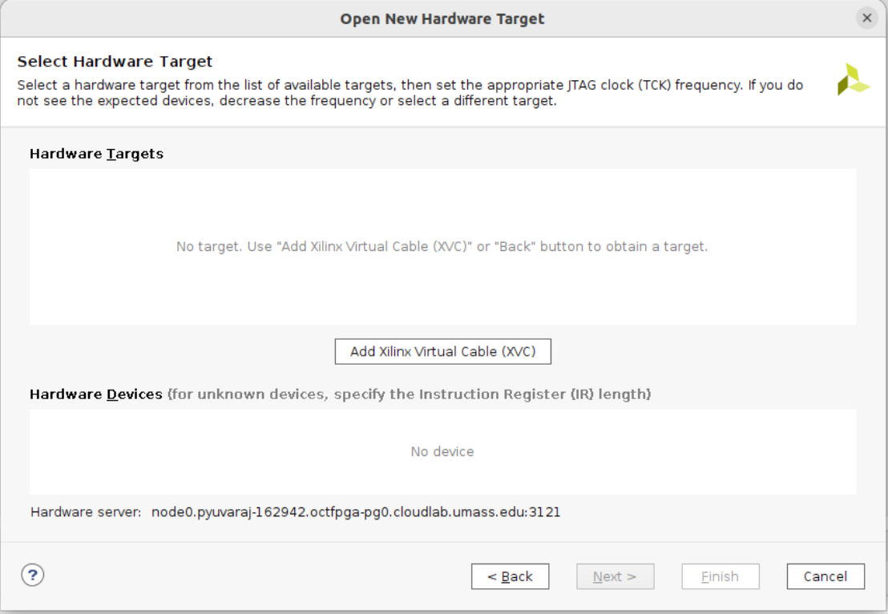

# Guide for Debugging with ChipScope remotely 

Here is a link to the official Xilinx's documentation, which provides more detail. This tutorial is designed to walk you through the steps visually, and provide you a quick way to setup System ILAs in HLS. 
Possibly in the future a Verilog/VHDL version will be created. 
Here is a link to the offical Xilinx tutorial: https://www.xilinx.com/developer/articles/debugging-your-applications-on-an-alveo-data-center-accelerator-.html. Some of the steps in this tutorial are a little different. 

## Installation 

```
git clone https://github.com/pyuvaraj37/hls_catch22.git
cd hls_catch22
```

## Software 
If a full installation of Vitis/Vivado is possible on both your remote and local machines, you will have the adequate software to perform remote debugging. If not the remote machine can just install Xilinx's Hardware Server. Also for connecting to the Hardware Server just Vivados Lab versions is enough since it has the Hardware Manager. 

## Adding ChipScope
We can add the \[debug\] header to our configuration file and add statements to monitor ports of our kernel. 

```
[debug]
chipscope=krnl_1:input
chipscope=krnl_1:output
```

These add System ILA monitors on the input and output ports of the krnl. 

## Build the bitstream and .tlx
You can build the bitstream with *make build TARGET=hw PLATFORM=<.xpfm>*, this specific design was tested with the U250 and U280. 

In the same directory the bitstream is build, there will be a .tlx file that is needed by ChipScope to setup the ILAs. Download this .tlx to your local machine that will be connecting to the remote server. 

## Host 
An addition that allows for setting up the ILAs is adding a wait statment after the device is programmed. 

```
wait_for_enter("\nPress ENTER to continue after setting up ILA trigger...");
```

## Setting up Xilinx's Virtual Cable through PCIE and the Hardware Server 
To setup the remote chipscope, we will need 3 terminals on the remote machine. 

One to run the bitstream and pause at the ILA setp. 

The second to start Xilinx's Virtual Cable through PCIE connection. This can be done with:
```
xvc_pcie -d /dev/xfpa/xvc_pub.<key>  
```
If the public key is not there, you can generate it with *xbutil validate -d*. 

The last terminal will be used to start the hw_server. 

As default the hw_server will open on 3121 and the xvc_pcie will open on 10200. These will be needed when connecting from the hardware manager. 

## Hardware Manager 
Once you open up the Hardware Manager in either Vivado or Vivado Lab. You can begin connecting to the device. Click on *Open Target*. Then *Open New Target*, a window will pop up and click next. 


Once you get the the screen that asks you for the hardware server info make sure to change *Connect to* to Remote Server. Then you can fill in the HW Server info with the correct port. Default port is 3121. Then click next. 


The screen may look like the image below, or it will have a HW Targert or debug bridge already connected. Regardless as long as at the bottom of the window the Hardware server is connected to your host with the correct port. 



Next, we will connect the XVC. The host is the same as the hardware server but instead of using the default port use 10200. This is the port for remote connections. 


Finish up the process with next and finish. 

Back to the HW Manager screen it will look different with the newly connected HW server. 


If you click on the *debug_bridge* it will open the Hardware Device Properties panel. Here is where we will upload our probe file (.tlx). 


After the window reloads, the waveform panel will be displayed. 


You can now set ILA triggers and press the play button. 


Once the ILA trigger is in the wait state, you can press enter on your terminal that is holding the executable. 


If the trigger is set is true, the waveform panel will reload with the new data. 

## End Notes 

